# Massive Loop Interaction Museum

The **Massive Loop Interaction Museum** is an immersive, cross-platform tutorial environment for both VR and Desktop PC. Designed to showcase the powerful built-in features of the Massive Loop SDK, it demonstrates how our component system empowers creators to enhance their Unity projects with dynamic, interactive elements with little to no scripting required.

Click this image to view the video!

Here, users can learn how specific components work through hands-on interactive displays. You are also able to view complex scripted objects, showcasing what can be accomplished by combining our components with custom C# scripting in Massive Loop.

We've built this world to be learned from and shared. If you're curious to see how it works, you can download the complete **`ML Museum`** Unity Package. Inside the project files, you're free to study the C# scripts, make edits, or pull the prefabs for complex objects directly into your own Massive Loop projects.

**Explore, interact, and discover the tools to bring your own immersive visions to life with Massive Loop!**

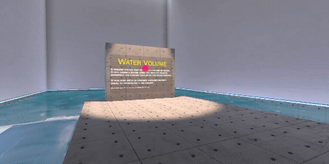

# Overview of Built-in Components

## MLGrab Component

Makes the attached object grabbable by the player. Player can both grab the object by pointing the layer pointer or by bringing their hands close to the object.

The MLGrab component allow dual hand grabbing of the objects. The first hand which grabs the object is called **Primary Hand** and the point that it grabs is referred to as **Primary Grab Point**. Other hand grabbing the object is referred to as **Secondary Hand** and the grab point which the secondary hand grabs on referred to as **Secondary Grab Point**.

By attaching [MLSynchronizer](https://docs.massiveloop.com/docs/create/components/MLSynchronizer) to the the object, the Grabbing events will be synchronized to everyone in the room.

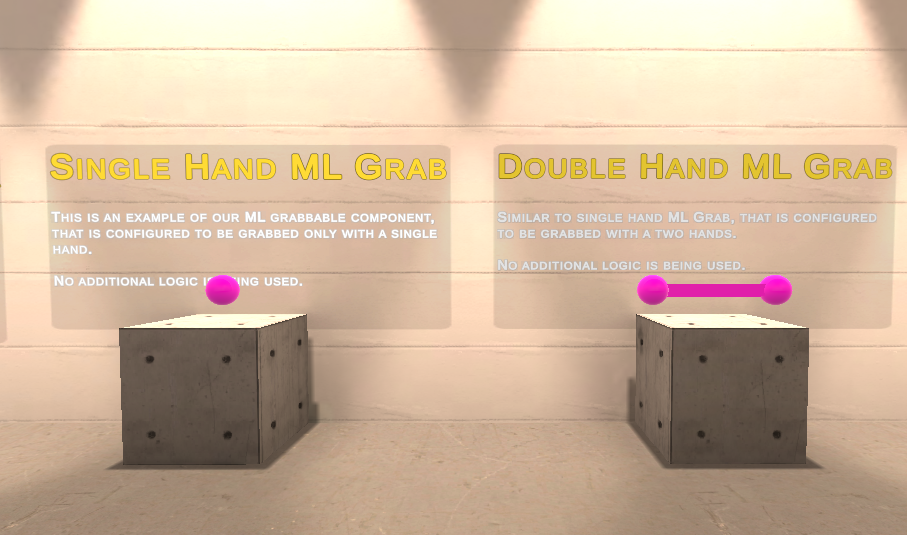

##### [Requires](https://docs.massiveloop.com/docs/create/components/list/MLGrab.html#requires)

- [MLSynchronizer](https://docs.massiveloop.com/docs/create/components/MLSynchronizer) (Optional for synchronization)

##### [Parameters](https://docs.massiveloop.com/docs/create/components/list/MLGrab.html#parameters)

| Name                           | Description                                                  |
| ------------------------------ | ------------------------------------------------------------ |
| **Grab Mechanic**              | The mechanic of the grabbing. By selecting the **Custom** and using Lua scripting you can create Custom grabbing mechanic. |
| - *Force Multiplier*           | Force Mode only. Amount of force factor to applied to the object. |
| - *Torque Multiplier*          | Force Mode only. Amount of torque to applied to the object.  |
| **Stick To Hand**              | Keeps the object grabbed by the hand, even if the grab button is released. Releasing the object requires pressing the grab object again. |
| **Apply Movement Physics**     | Keeps track of the linear and angular velocities of the object while it is grabbed by player and applies them to object when released. |
| **Surface Grab**               | By enabling this, the object becomes grabbable at any point on surface of any collider attached to it. If not selected, the grab points need to be defined for both primary and secondary hands. |
| **Grab Locations**             | Grab Location will define the location and orientation which the object will be grabbed by the player. Check out [MLGrabPoint](https://docs.massiveloop.com/components/MLGrabPoint.html) . |
| *On Primary Grab Begin ()*     | Event fired when a player grabs the object by primary hand. This event will be synchronized if MLSynchronizer is used. |
| *On Primary Grab End()*        | Event fired when the player releases the object from the primary hand. This event will be synchronized if MLSynchronizer is used. |
| *On Secondary Grab Begin()*    | Event fired when the player grabs the object by their secondary hand. This event will be synchronized if MLSynchronizer is used. |
| *On Secondary Grab End ()*     | Event fired when the player released the object from secondary hand. This event will be synchronized if MLSynchronizer is used. |
| *On Primary Trigger down ()*   | Event fired when the player presses down the trigger button while holding to the primary grab point of the object. This event will be synchronized if MLSynchronizer is used. |
| *On Primary Trigger Up ()*     | Event fired when the player releases the trigger button while holding to the primary grab point of the object. This event will be synchronized if MLSynchronizer is used. |
| *On Secondary Trigger Down ()* | Event fired when the player presses down the trigger button while holding to the secondary grab point of the object. This event will be synchronized if MLSynchronizer is used. |
| *On Secondary Trigger Up ()*   | Event fired when the player releases the trigger button while holding to the secondary grab point of the object. This event will be synchronized if MLSynchronizer is used. |

## MLClickable

MLClickable component makes a GameObject clickable by player. You can register the click event and use it in variety of ways. For example, it can be used as a simple button, or you can use the Link functionality to load a URL in a link.

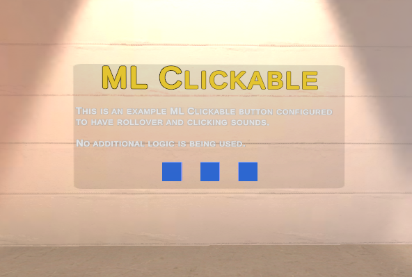

## MLStation

MLStation component provides a mean to attach players to another object. The most common use for this is creating a seat. When attached to the station, the player loses its movement abilities, but still can move their head and hands. Using the Lua, the player controller inputs can be accessed and used to drive vehicles.

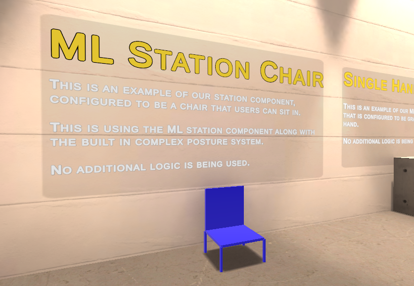

## MLPlatform

Makes the attached object a platform where players can stand on it and move by it. The players movement calculated relative to the platform when they are standing on a platform, therefore the movement of the platform will not throw out the players. Use this to create moving object where players can move along with them by just standing on them.

You can adjust the platform to create a local gravity which will affect any player step on it.

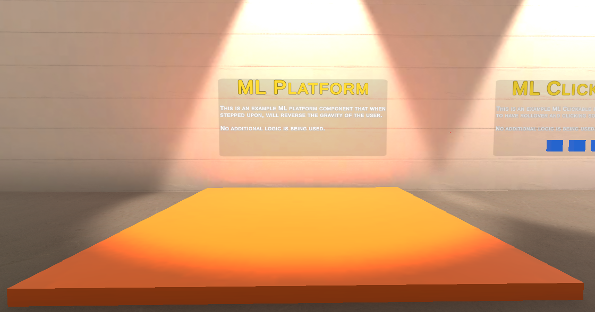

## MLPortal

Portal component turns any object with a collider (trigger) to a portal to the specified world in Massive Loop metaverse.

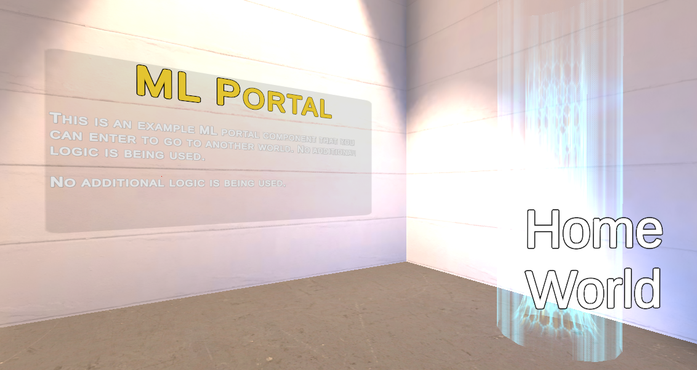

## Streaming Browser & Video Player

This component creates an web browser in the world space. This web browser can be used and interacted by users in the room, or to be locked. This component can be used to stream videos from various online streaming services.

Note that the user inputs to this browser is not inherently synchronized. To perform synchronized changes to the browser, users can request the "Remote Control" and preform those changes from there. when request-able is unchecked, it allows the any user to control the web browser.

The Remote control can be spawned using `secondary` in VR and `f` + `RMB` or `esc`+`RMB` for Desktop Mode.

**Note**: Make sure the Gizmos are enabled in the browser in order to modify the browser surface.

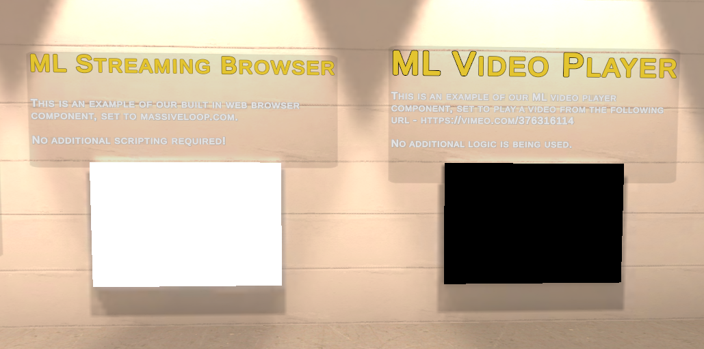

## MLMirror

Creates a mirror in defined area. Make sure the Gizmos are active to edit the surface.

##### [Parameters](https://docs.massiveloop.com/docs/create/components/list/MLMirror.html#parameters)

| Name                      | Description                                     |
| ------------------------- | ----------------------------------------------- |
| **Mirror Layer**          | The layers the mirror will render.              |
| **Use Occlusion Culling** | Enable occlusion culling for the mirror camera. |
| **Active By Default**     | Is the mirror active by default?                |

##### [Event Actions ](https://docs.massiveloop.com/docs/create/components/list/MLMirror.html#event-actions)

| Action                 | Description             | Input |
| ---------------------- | ----------------------- | ----- |
| **ActivateMirror()**   | Activates the mirror.   | none  |
| **DeactivateMirror()** | Deactivates the mirror. | none  |
| **ToggleMirror()**     | Toggles the mirror.     | none  |

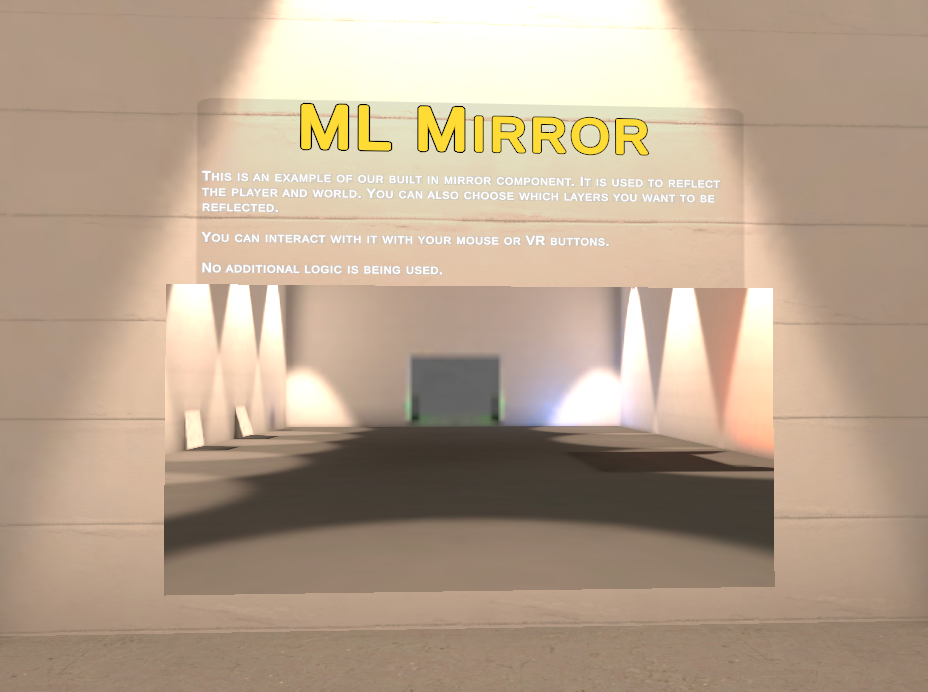

# Custom C# Scripting Examples

## Omni Pen

The Omni Pen system here operates like any other VR drawing pen, allowing the user to draw in 3d space.

It utilizes an MLGrab component to determine when the user is drawing, when they aren't and when they let go of the pen.

Each button on the UI canvas systems make use of the MLClickable component to decipher when a user interacts with it. This is also used for the color selection process.

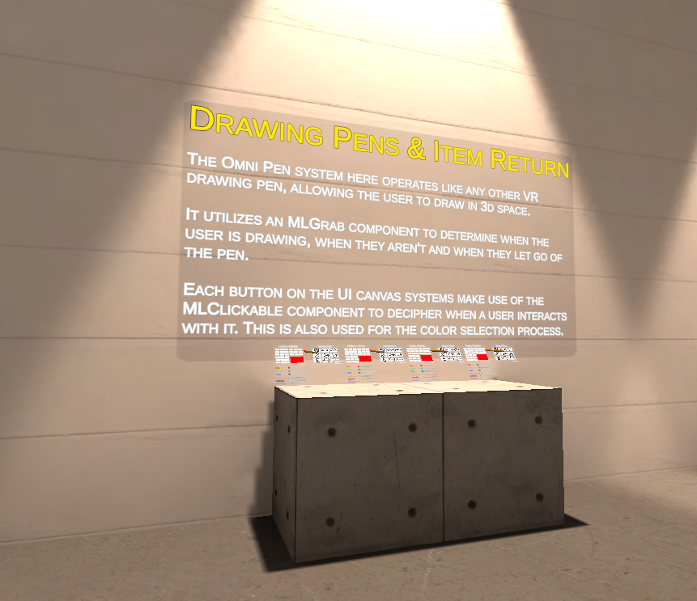

## Laser

This is an example raycast based "weapon". It makes use of the MLGrab component to attach event listeners to each of the following events :
- On Primary / Secondary | Grab begin / end
- On Primary / Secondary | Trigger down / up
- And More!

Each event is synchronized, making the process of creating event-based systems with our MLGrab Component exceptionally easy!

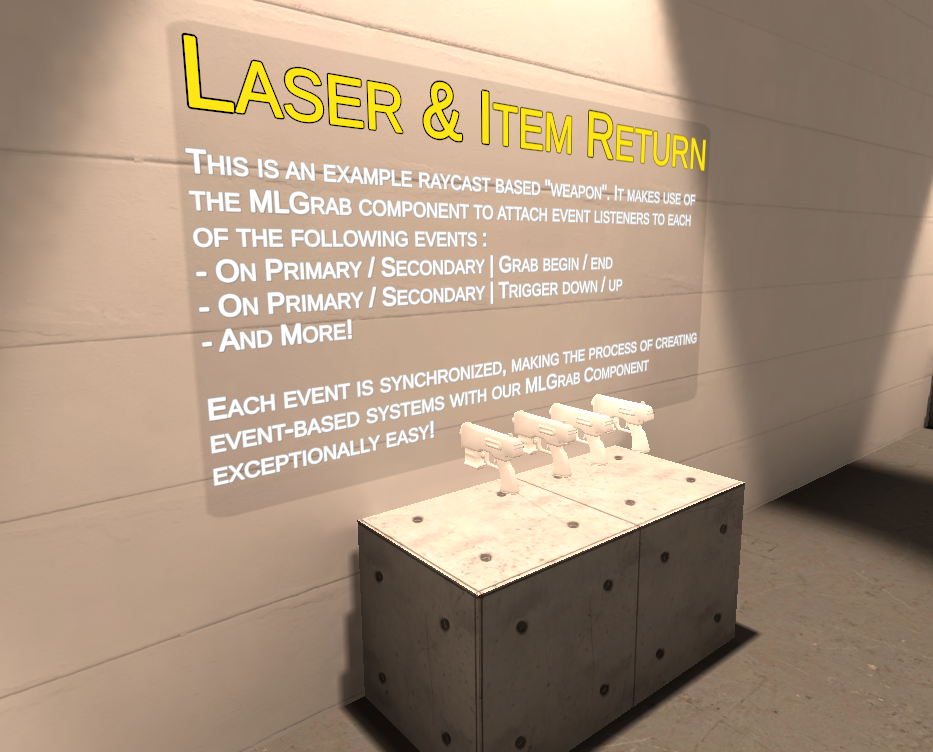

## Grapple Hook

This grapple hook makes heavy use of the MLGrab component.

The mechanics here cause the user to grapple to the object their hook has collided with.

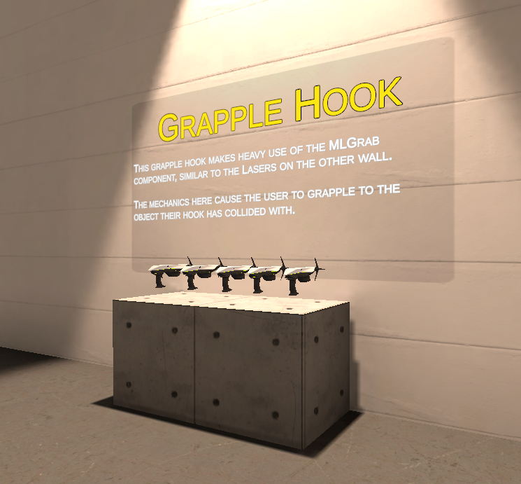

## Water Volume Buoyancy

A trigger volume that acts like a volume of water. It will spawn a splash when the user or objects enter/exit the trigger volume on the water surface. 

It will also apply an upwards buoyancy physics force to rigidbodies in the volume.

(Note that User rigidbodies are currently unaffected)

## Object Spawner & Physics Sound

When the button is clicked, a single hand grabbable is spawned. This is synchronized across clients. 

This spawner is set to a limit of 10 objects for user comfort.

#### Physics Sound

This is a grabbable object that plays impact sounds on collision events. When there is a low impact collision, low impact sounds are played. When there is a high impact collision, high impact sounds are played.

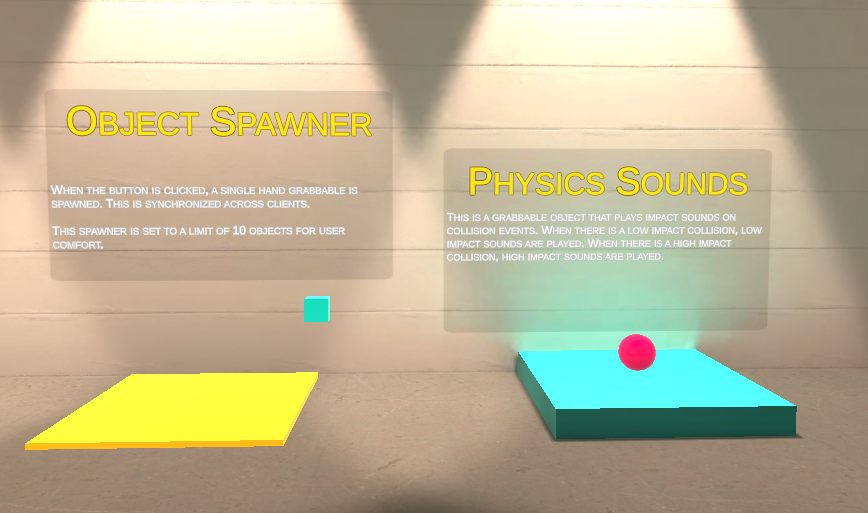

## Teleport Examples

#### Trigger Teleport

When the local user walks into this trigger volume, they will be teleported to a specific gameobject position. In this instance you will be teleported back to the world spawn point.

#### Button Teleport

When the local user walks into this trigger volume and presses a button, they will be teleported to a specific gameobject position. In this instance you will be teleported back to the world spawn point.

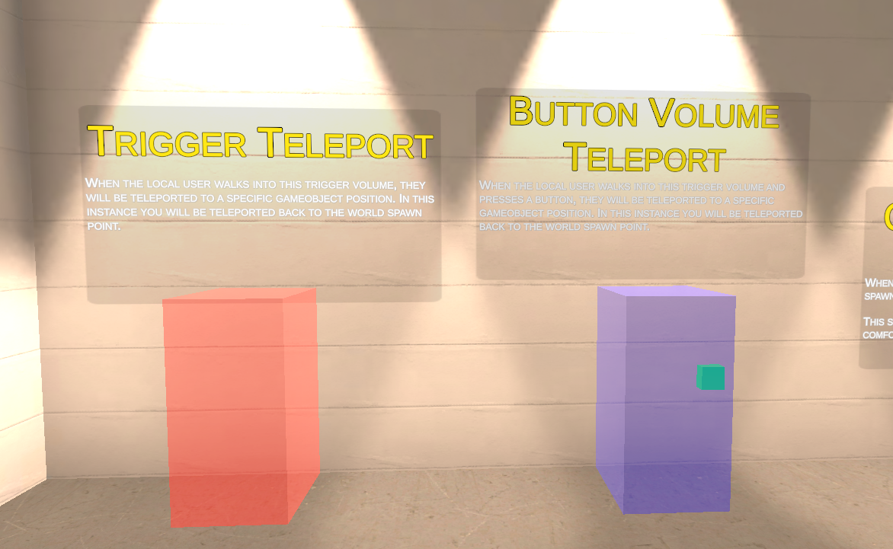

## Door Examples

* **Trigger Door**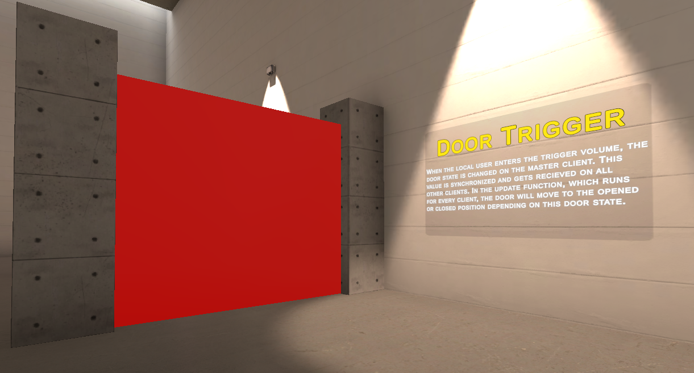

* **Button Door**

  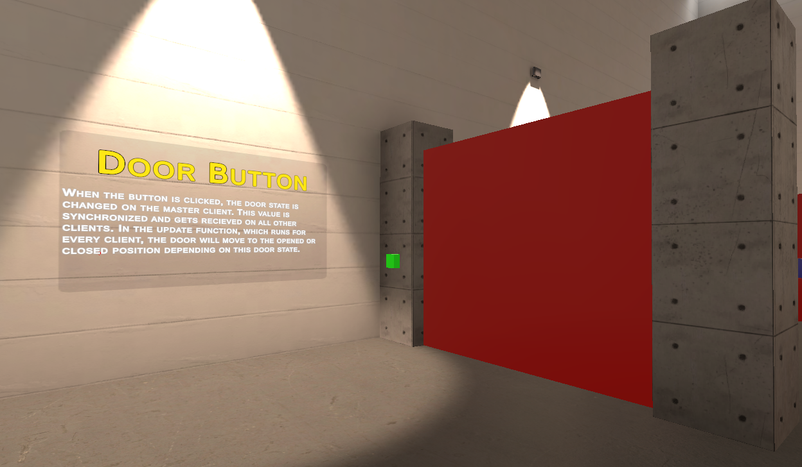

* **Non-physics door**

  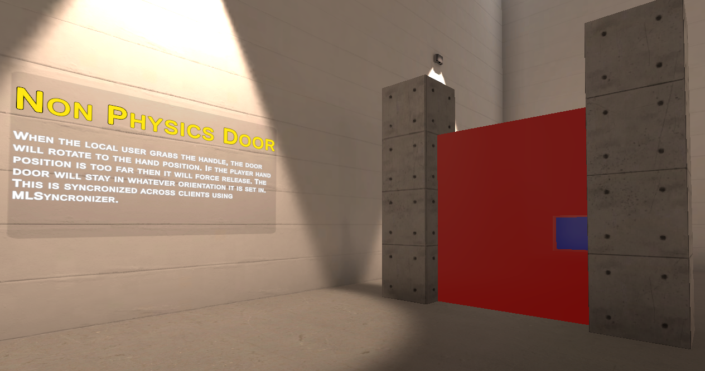

* **Physics based door**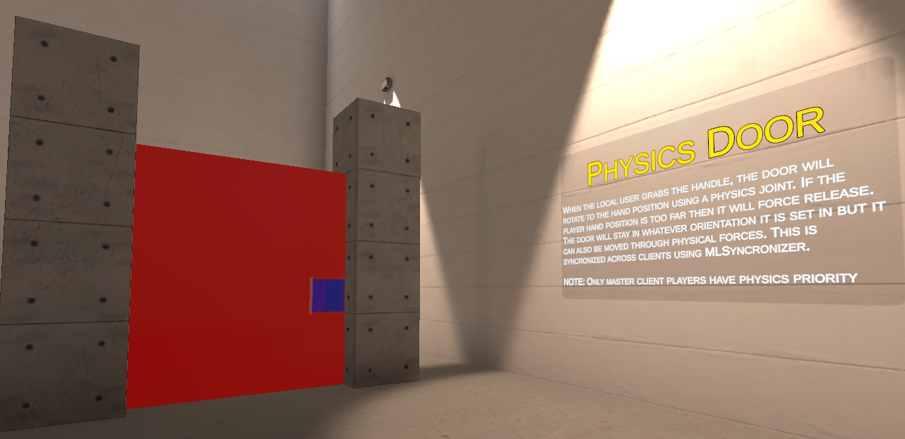

